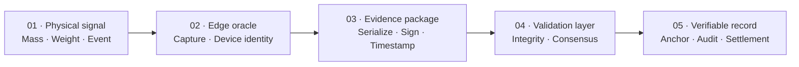

<div align="center">
  

  <br />

  

  <br />

  

  <br /><br />

  
  
  

  <br /><br />

  <strong>Physical events → cryptographic evidence → auditable digital records</strong>
  <br />
  <sub>Infrastructure for verifiable mass, custody, provenance, and settlement.</sub>
</div>

---

<div align="center">
  <a href="https://www.powvprotocol.com"></a>
  <a href="https://powv-protocol.gitbook.io/powv-protocol-docs/"></a>
  <a href="https://github.com/powvprotocol-org"></a>
  <a href="https://powvprotocol.substack.com/"></a>
  <br />
  <a href="https://www.linkedin.com/company/powv-protocol/"></a>
  <a href="https://www.linkedin.com/in/gabriel-protocolpowv/"></a>
  <a href="https://www.youtube.com/@GabrielProtocolPowv"></a>
  <a href="https://orcid.org/0000-0002-3415-4484"></a>
  <a href="https://github.com/GabsDevX"></a>
</div>

<p align="center">
  <a href="#01--architect-profile">Profile</a> ·
  <a href="#02--legal--ip-governance">IP Governance</a> ·
  <a href="#03--powv-protocol">Protocol</a> ·
  <a href="#04--reference-architecture">Architecture</a> ·
  <a href="#05--operational-verticals">Verticals</a> ·
  <a href="#06--deployment-roadmap">Roadmap</a> ·
  <a href="#07--financial-architecture">Market Capture</a> ·
  <a href="#08--institutional-inquiries">Contact</a>
</p>

---

## 01 — Architect Profile

### Gabriel de Almeida Santos Silva

Cyber-Physical Systems Architect and Full-Stack Infrastructure Engineer focused on hardware-rooted security, decentralized data consensus, and trust enforcement for heavy-industry supply chains.

The work connects physical measurement with cryptographic validation, converting raw events into traceable digital evidence for audit, settlement, and institutional integration.

> **Core thesis**
>
> Digital records become economically meaningful only when the physical event at their origin can be measured, identified, preserved, and independently verified.

---

## 02 — Legal & IP Governance

> [!IMPORTANT]
> **Corporate and intellectual-property perimeter**
>
> Proprietary edge architectures, software structures, metrological-oracle models, technical research, and associated trade secrets are governed through a dedicated corporate IP framework.

<details>
<summary><strong>Legal enforcement registers</strong></summary>

```text
[BR JURISDICTION]
├── Software Law          Lei nº 9.609/1998
├── Industrial Property  Lei nº 9.279/1996
└── Electronic Signature Lei nº 14.063/2020

[INTERNATIONAL FRAMEWORK]
├── Intellectual Property TRIPS Agreement
└── Governance            WIPO Framework
```

| Entity attribute | Corporate and legal registry |
| --- | --- |
| **Corporate name** | `58.046.660 Gabriel de Almeida Santos Silva` |
| **National registry** | `CNPJ 58.046.660/0001-93` |
| **Jurisdiction** | Brazil · applicable international treaties |
| **Legal framework** | Lei nº 9.609/1998 · Lei nº 9.279/1996 · TRIPS Agreement |
| **IP governance model** | Technology holding for software licensing and metrological-oracle models |

</details>

---

## 03 — PoWV Protocol

The **Proof of Waste Value (PoWV) Protocol** is a physical-to-digital trust infrastructure designed to capture, validate, and preserve evidence at the edge of high-value supply chains.

### The infrastructure gap

> [!WARNING]
> **The cyber-physical oracle problem**
>
> Many Real-World Asset systems begin after data has already entered an editable database, spreadsheet, or human-controlled reporting workflow. This leaves the physical origin of the record exposed to manipulation, ambiguity, and settlement disputes.

### The protocol response

PoWV acts as a non-invasive verification layer over existing industrial infrastructure. It captures telemetry close to its physical source, binds the event to device identity and context, produces cryptographic evidence, and routes the resulting record toward validation and audit layers.

| Design principle | Operational effect |
| --- | --- |
| **Source proximity** | Evidence is produced close to the measurement event. |
| **Hardware-rooted identity** | Device keys bind telemetry to an identifiable physical source. |
| **Non-invasive integration** | Existing scales, sensors, terminals, and enterprise systems remain operational. |
| **Cryptographic continuity** | Serialization, signatures, hashes, and timestamps preserve event integrity. |
| **Audit-ready output** | Validated records can support custody, settlement, compliance, and RWA workflows. |

### Institutional market context

| Institution or market actor | Strategic context | Reference |
| --- | --- | --- |
| **IMF & World Bank** | Institutional exploration of tokenization and digital-finance infrastructure | [IMF](https://www.imf.org) |
| **World Economic Forum** | Green-economy and digital-infrastructure transition | [World Economic Forum](https://www.weforum.org) |
| **Major financial institutions** | BlackRock, J.P. Morgan, and Goldman Sachs have publicly explored tokenized-asset infrastructure | [Forbes thesis](https://www.forbes.com/sites/roomykhan/2023/06/29/asset-tokenization-a-trillion-dollar-market-opportunity-jp-morgan-blackrock-and-goldman-think-so/) |

---

## 04 — Reference Architecture

### Physical-to-digital evidence pipeline



> [!NOTE]
> **The trust-toll retrofit model**
>
> PoWV is designed as an inline cryptographic interceptor over existing commodity and logistics flows. The protocol does not replace the physical asset; it signs and validates the asset's state telemetry.

### Execution architecture

| Stage | Mechanism | Strategic outcome |
| --- | --- | --- |
| **01 · Zero-disruption capture** | Non-intrusive edge sensors and legacy telemetry interfaces | Retrofit industrial scales without unnecessary civil works. |
| **02 · IP execution layer** | B2B software licensing and high-frequency telemetry auditing | Separate software value from physical-equipment liability. |
| **03 · Chokepoint deployment** | High-volume corridors, terminals, ports, and custody handovers | Verify evidence where physical and economic flows converge. |

```text
SYSTEM STATUS  active
MISSION        enforce verifiable truth at the edge
```

---

## 05 — Operational Verticals

PoWV is designed as a common verification layer that can produce secure edge evidence across multiple high-value physical domains.

| Sector or node | Cyber-physical execution | Payload and cryptographic outcome |
| --- | --- | --- |
| **Heavy rail** | Dynamic mass telemetry and continuous weighing | Verifiable operational records and anomaly detection |
| **Maritime logistics** | Spatial-temporal validation during custody handovers | Bulk-load integrity and multimodal custody evidence |
| **Industrial forestry** | Cryptographic evidence of physical mass and provenance | Auditable chain of custody for raw materials |
| **Agri-commodities** | Edge sensorization at automated terminals | Validated events for settlements and smart-contract triggers |
| **Remote extraction** | Compressed payload routing through LEO satellite links | Resilient edge-to-ledger transmission where terrestrial coverage is unavailable |

---

## 06 — Deployment Roadmap

Capital deployment and technical delivery follow phased validation gates intended to reduce integration, hardware, and institutional risk.

| Phase | Scope | Status |
| --- | --- | :---: |
| **01 · Proof of Concept** | Validate non-invasive signal capture, edge cryptography, and compressed telemetry under controlled conditions. | `COMPLETE` |
| **02 · Minimum Viable Product** | Harden hardware-in-the-loop firmware and validate initial ledger anchoring under higher throughput. | `IN PROGRESS` |
| **03 · Industrial Pilot** | Execute with strategic logistics partners in operational infrastructure. | `PLANNED` |
| **04 · Inflows & Off-take** | Activate institutional capital and commercial off-take structures after technical validation. | `LOCKED` |

---

## 07 — Financial Architecture

### Market-capture register

```text
SYSTEM REGISTER · TAM & PIPELINE EVALUATION

Global supply-chain software TAM    10,000,000,000,000 USD
Target capture fraction                          0.1%
Addressable pipeline value          10,000,000,000 USD
```

<div align="center">
  
</div>

### Economic capture model

| Revenue vector | Execution architecture | Risk mitigation |
| --- | --- | --- |
| **Software licensing** | Enterprise deployment and infrastructure-integration fees | Limits exposure to physical-scale ownership and maintenance |
| **Transaction tolls** | Micro-fees per validated cryptographic payload | Usage-linked, high-margin infrastructure model |
| **Verification premium** | Pricing tied to the role of PoWV as a digital anchor for physical evidence | Value derives from integrity, auditability, and operational trust |

> [!CAUTION]
> Market-size figures and pipeline values are strategic estimates, not guarantees of revenue, valuation, investment return, or commercial adoption.

---

## 08 — Institutional Inquiries

```text
VENTURE GATEWAY  OPEN
STAGE            Pre-Seed · Strategic Ecosystem Grants
FOCUS            Infrastructure syndicates · Deep-tech VCs · Strategic partners
```

> [!WARNING]
> **Secure data room and NDA requirements**
>
> Forward-looking financial models, architecture blueprints, pilot-performance metrics, and pending commercial agreements are restricted. Access to confidential material requires an executed Mutual Non-Disclosure Agreement.

- **Executive contact:** [gabriel@powvprotocol.com](mailto:gabriel@powvprotocol.com)
- **Protocol organization:** [github.com/powvprotocol-org](https://github.com/powvprotocol-org)
- **Technical documentation:** [PoWV Protocol Documentation](https://powv-protocol.gitbook.io/powv-protocol-docs/)

---

<div align="center">
  <h3>Tracks exist. Scales exist. Satellites exist.</h3>
  <strong>What was missing was admissibility.</strong>

  <br /><br />

  <code>© 2026 PoWV Protocol™ · Gabriel de Almeida Santos Silva · All rights reserved.</code>
  <br />
  <sub>Technology governed under applicable Brazilian law and international intellectual-property frameworks.</sub>
</div>

<br />

<div align="center">
  
</div>
